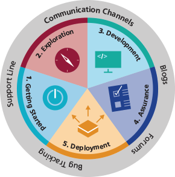
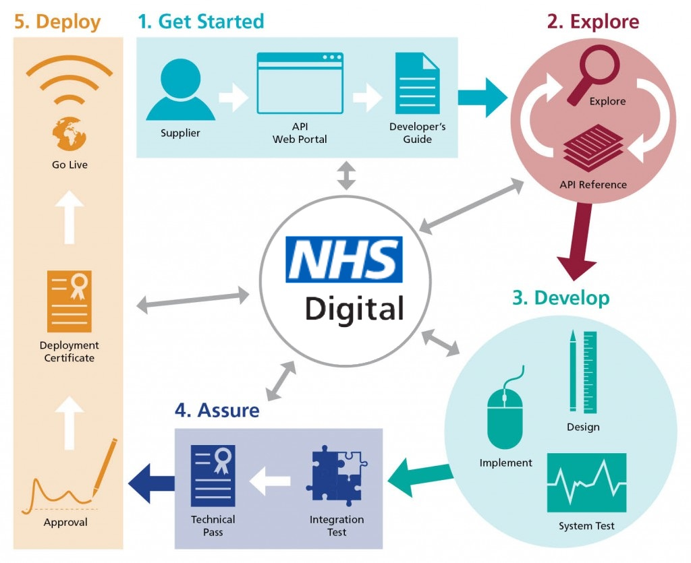

## Application Programming Interface (API) ##

A key aspect of the NHS e-RS vision is to enable local innovation and adoption of paperless referrals. To support this vision NHS Digital have created a set of APIs which provide a well-defined, simple to use data interface to the NHS e-Referral Service (e-RS).

We want to stimulate and assist your development of applications linked to the NHS e-RS using these APIs, so within these pages you will find information about the functionality of these APIs as well as guidance on how we can support you throughout development and implementation.

## Functionality and Future Roadmap
#### Currently the e-RS Integration APIs provide the following functionality:
- [Smartcard Authentication and Authorisation](https://developer.nhs.uk/apis/e-Referrals/develop_business_flow_bf001.html)
- [Clinical Referral Information](https://developer.nhs.uk/apis/e-Referrals/develop_business_flow_bf002.html)

#### Coming Soon:
- [Create Referral (Q4 2019)](https://developer.nhs.uk/apis/e-Referrals/develop_business_flow_bf004.html)
- [Clinical Review (Q1 2020)](https://developer.nhs.uk/apis/e-Referrals/develop_business_flow_bf003.html)

The NHS e-Referral Service Future integration roadmap is available [here](https://digital.nhs.uk/services/e-referral-service/integration).

## The e-Referrals API Hub ##

The site has five main parts. Each aligns to a phase of development and partner engagement with NHS Digital, as shown below.  

A summary of the activities and the support material in each of the phases are as follows:

|Phase&nbsp;&nbsp;&nbsp;&nbsp;&nbsp;&nbsp;&nbsp;&nbsp;&nbsp;&nbsp;&nbsp;&nbsp;&nbsp;&nbsp;&nbsp;&nbsp;|Description|
|---|---|
|1.&nbsp;Get&nbsp;Started | How to get started with development, including registration for new partners and connection to development environments|
|2.&nbsp;Explore | Overview of the functionality available through the APIs with business flow examples and links to technical documentation |
|3.&nbsp;Develop | Complete list of available APIs and their status with technical documentation and information about support during the development phase |
|4.&nbsp;Assure | Information on the compliance process, technical accreditation and advice on clinical safety reviews |
|5.&nbsp;Deploy | Guidance on the process for going live and live service support |

## NHS e-RS API Development Journey ##
The diagram below provides a more detailed view of a typical Development Journey as a sequence of phases together with the key activities, support materials and/or services provided by the API Hub.  

  

## Further Resources ##

A key consideration for any remote access service is the requirement that patient data is safe and protected. There are many rules that govern controls and protection when accessing systems and application remotely. To learn more about the Government Digital Service standards visit the [NHS Digital Industry Standards](https://digital.nhs.uk/services/health-and-social-care-network/hscn-technical-guidance/business-applications-guidance/industry-standards) pages.

The e-RS integration APIs have been developed to be compliant with HL7 Fast Healthcare Interoperability Resources (FHIR) standards. More information about FHIR APIs is available at [https://digital.nhs.uk/services/fhir-apis](https://digital.nhs.uk/services/fhir-apis).
